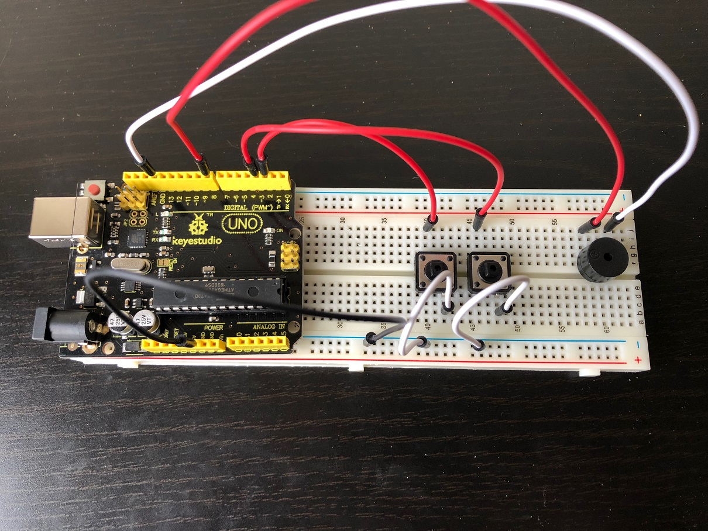

# HamRadioArduino
Projects from ARRL's **Ham Radio for Arduino and PICAXE**

Easy to build microcontroller weekend projects for amateur radio use

---
### Chapter 1: CQ DX
[Sketch File](Ch01-CQDX/Ch01-CQDX.ino)

--- 